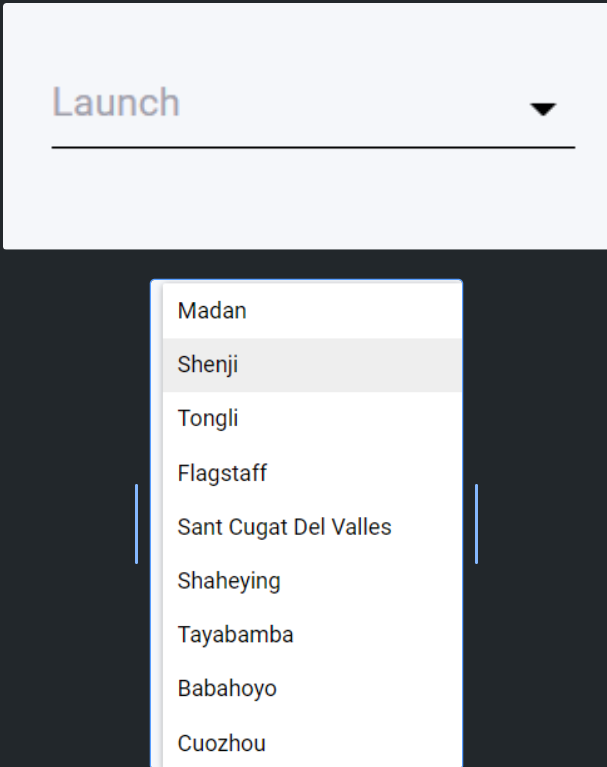
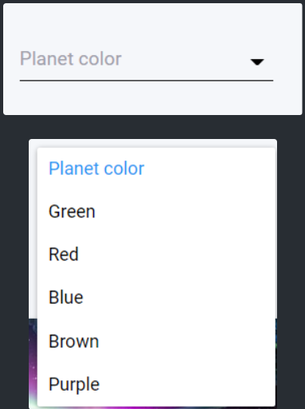
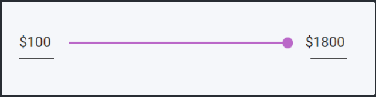

## Description

COMO **usuario**

QUIERO **clasificar mis viajes según destino, color y precio**

PARA **poder visualizar los destinos deseados**

-----

## ✅ACCEPTANCE CRITERIA

    Feature: clasificar según destino, color y precio.

    Background:
        Given: usuario tiene acceso al site "Space&Beyond"
        And: busca destino con el "Destiny Selector"

        Scenario 1: usuario selecciona destino.
            When: hace click en el dropdownList "Launch"
            And: seleccionar algún destino
            Then: la galería de cards se actualiza con el DESTINO seleccionado

        Scenario 2: usuario selecciona color.
            When: hace click en el dropdownList "Planet Color"
            And: seleccionar algún color
            Then: la galería de cards se actualiza con el COLOR seleccionado

        Scenario 3: usuario desliza el rango de precios deseado
            When: desliza el rango de precios deseado
            Then: la galería de cards se actualiza con el PRECIO seleccionado

----

## 🚩BUSINESS RULES SPEC

    HOME PAGE: GALLERY

    INPUT -  DROPDOWN LIST (LAUNCH):

        Se debe visualizar las distintas opciones de destino. (revisar MOCKUP).

        BR: El resultado del filtro debe mostrar todas las cards que hagan match con el destino elegido (según Master Data).

    INPUT -  DROPDOWN LIST (PLANET COLOR):

        Se debe visualizar las distintas opciones de color. (revisar MOCKUP).

        BR: El resultado del filtro debe mostrar todas las cards que hagan match con el color elegido (según Master Data).

    INPUT - SLIDER:

        Se debe visualizar el rango de precios. (revisar MOCKUP).

        BR: El resultado del filtro debe mostrar todas las cards que hagan match con el precio elegido (según Master Data).

----

## 🎴MOCKUP

**MOCKUP DE LA BR DROPDOWNLIST “LAUNCH“.**

**MOCKUP DE LA BR DROPDOWNLIST “PLANET COLOR“.**

**MOCKUP DE LA BR “SLIDER”.**

